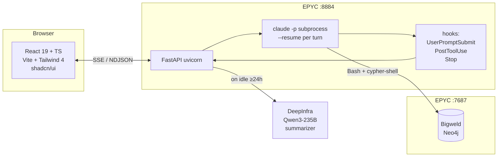
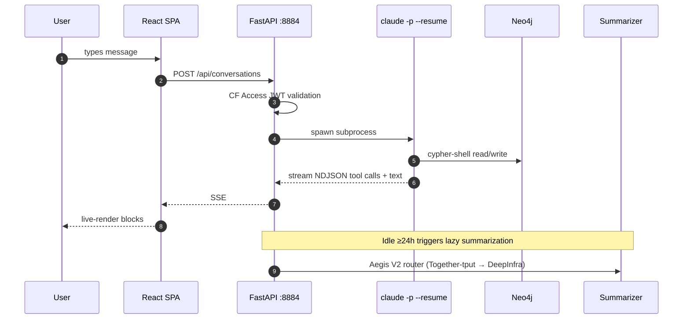

# Bigweld DA Portal

> Work-augmentation chat surface for the Bigweld Domain Agent.

Live at [`bigweld.ninerealms.me`](https://bigweld.ninerealms.me) (Cloudflare Access protected). Bigweld is the fourth Domain Agent in Alex's stack, scoped to **work + work-flavored ideation only** — SFDC architect work, HPE Pointnext / Storage / GreenLake support, KB curation, deliverable drafting. The substrate is the [Bigweld Neo4j second-brain](../bigweld/) at `/datapool/bigweld/`.

---

## Architecture



The backend wraps `claude -p --resume` as a per-turn subprocess. Each user message spawns a fresh Claude run with the same session UUID; conversation continuity is achieved via `--resume`, not in-process state. Three Claude Code hooks persist conversation state to filesystem JSON between turns. Substrate access is read+write via `cypher-shell` — nothing in-process.

---

## Per-turn flow



---

## Tech stack

| Layer | Choice |
|---|---|
| Frontend | Vite + React 19 + TypeScript + Tailwind 4 + shadcn/ui + Zustand + TanStack Query |
| Editor | Tiptap + Mention extension |
| Render | Mermaid + D2 (WASM, lazy-loaded) for in-chat diagrams |
| Backend | Python 3.12 + FastAPI + uvicorn + sse-starlette + structlog + prometheus-client |
| Auth | Cloudflare Access JWT (audience tag + signature + email allowlist) |
| Subprocess | `claude -p --resume <session_uuid>` per turn |
| Substrate | Neo4j 5.x (Bigweld) via `cypher-shell` |
| Summarizer | DeepInfra Qwen3-235B-A22B-Instruct-2507, Together `-tput` fallback |
| Persistence | Filesystem JSON canonical (`conversations/<uuid>.json`) |
| Observability | `/metrics` (Prometheus) + structlog JSON to journald |

---

## Auth

Cloudflare Access fronts the public hostname. Backend validates the `Cf-Access-Jwt-Assertion` header on every `/api/*` route:

1. **JWKS fetch** from `https://<team>.cloudflareaccess.com/cdn-cgi/access/certs` (5-minute cache).
2. **RS256 signature** verification.
3. **Audience match** against the **AUD Tag** (SHA256-style hex) — *not* the Application UUID. They look similar in the CF dashboard. Easy to confuse; cost us a same-day outage on 2026-04-29 (commit `18c8aae`).
4. **Issuer match.**
5. **`email` claim** must equal `BIGWELD_ALLOWED_EMAIL`.

Only `/health` is unauthenticated, for loopback systemd probes.

---

## Layout

```
bigweld-portal/
├── CLAUDE.md         Bigweld DA's identity (loaded by claude -p)
├── memory/           persona, working-with-alex, world-model, never-list
├── skills/           chat-time skills: graph, gaps, orphans, rollup,
│                       dupes, citations, search-past-conversations
├── .claude/          hook config + scripts
│   └── hook-scripts/ session-start, user-prompt-submit, post-tool-use,
│                       stop, memory-recall, graph-awareness
├── backend/          FastAPI + subprocess manager + stream parser
│   ├── auth.py       CF Access JWT validation
│   ├── core/         config, llm_router, subprocess_mgr, summarizer
│   └── tests/        pytest (httpx + pyfakefs)
├── frontend/         Vite + React + TS SPA
│   └── tests/        vitest + Playwright canonical-flow E2E
├── scripts/          deploy, palette extraction, font conversion,
│                       hook-script bats smoke tests
├── conversations/    runtime data (gitignored)
├── output/           runtime artifacts (gitignored)
└── systemd/          unit file template
```

---

## Run locally

```bash
# Backend (hot reload)
cd backend && uv run uvicorn main:app --reload --port 8884

# Frontend (Vite dev server)
cd frontend && npm install && npm run dev

# Backend tests
.venv/bin/pytest backend/tests -v

# Frontend tests
cd frontend && npm test

# Playwright E2E (requires running stack)
cd frontend && npm run e2e

# Hook script smoke
cd scripts && bats *.bats
```

---

## Deploy

Production runs as a systemd unit (`bigweld-portal.service`) on EPYC `:8884`, fronted by Cloudflare tunnel. The SPA is built (`npm run build`) and served as static assets by the FastAPI app, with a SPA fallback that probes `dist/` first before falling through to `index.html`.

`OnFailure=` drop-in routes alerts to the Jarvis Telegram bot. The predecessor `oracle-portal.service` is stopped + disabled on EPYC, with its unit file retained 30 days for emergency rollback (cutover was 2026-04-28).

---

## References

- Spec: `oracle:/datapool/oracle/docs/superpowers/specs/2026-04-27-bigweld-portal-design.md`
- Plan: `oracle:/datapool/oracle/docs/superpowers/plans/2026-04-27-bigweld-portal-implementation.md`
- v1.5 review remediation: commit `99c45cc` (JWT auth, subprocess hardening, frontend selectors)
- AUD-tag fix: commit `18c8aae` (App UUID ≠ AUD claim)
- Build log notes: `oracle:/datapool/oracle/memory/project_bigweld_portal_build_20260427.md` and `project_bigweld_portal_shipped.md`
